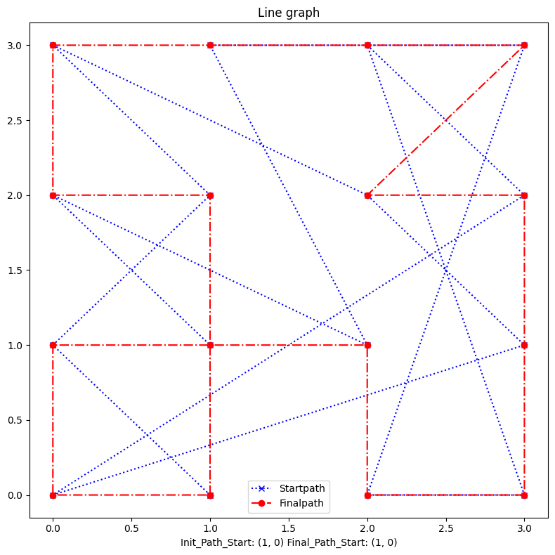

# 作業參考老師的通用爬山演算法

# Results:
- Init Path:
```
Init path :  [0, 1, 2, 3, 4, 5, 6, 7, 8, 9, 10, 11, 12, 13, 14, 15, 0]
Init pathLength :  32.28586956270706
```
- Final Path:
```
Final path :  [0, 15, 2, 14, 3, 12, 8, 11, 4, 7, 5, 9, 10, 13, 1, 6, 0]
Next: (1, 0)
Next: (1, 1)
Next: (1, 2)
Next: (0, 2)
Next: (0, 3)
Next: (1, 3)
Next: (2, 3)
Next: (3, 3)
Next: (2, 2)
Next: (3, 2)
Next: (3, 1)
Next: (3, 0)
Next: (2, 0)
Next: (2, 1)
Next: (0, 1)
Next: (0, 0)
Next: (1, 0)
Final pathLength :  17.414213562373096
```
