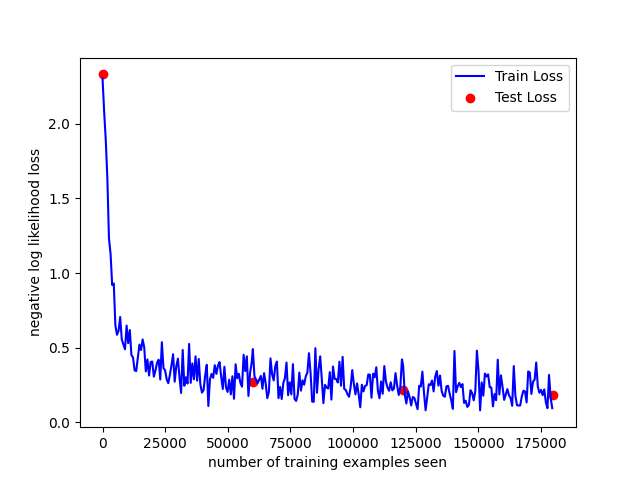
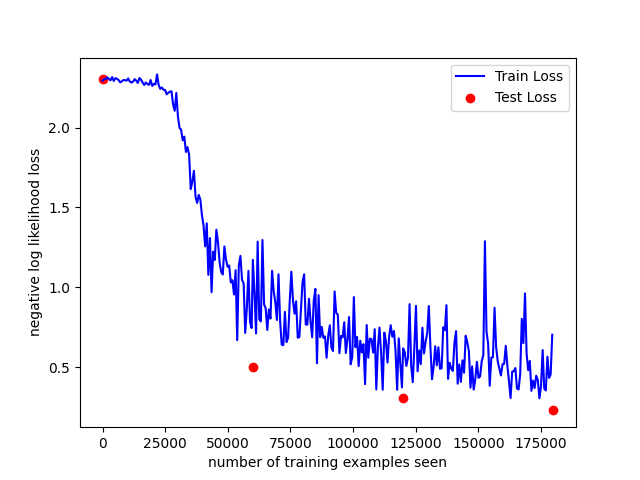
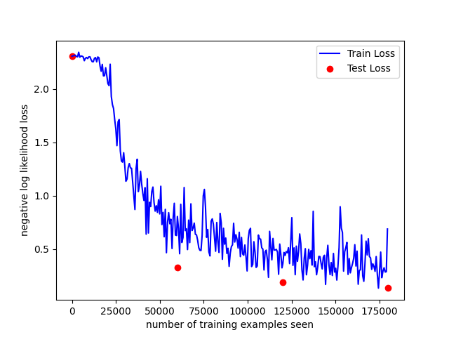
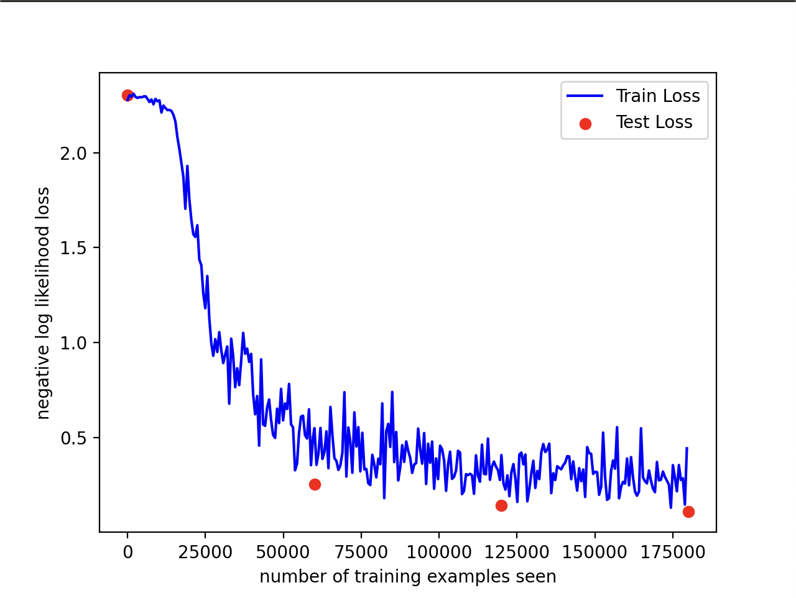

- 參考老師的範例後修改

1. model1 :
    - `Test set: Avg. loss: 0.1859, Accuracy: 9471/10000 (95%)`
    - 
2. model2 : 
    - `Test set: Avg. loss: 0.2281, Accuracy: 9305/10000 (93%)`
    - 
3. model3 : 
    - `Test set: Avg. loss: 0.1377, Accuracy: 9578/10000 (96%)`
    - 

4. model4 :
    - `Test set: Avg. loss: 0.1103, Accuracy: 9683/10000 (97%)`
    - 